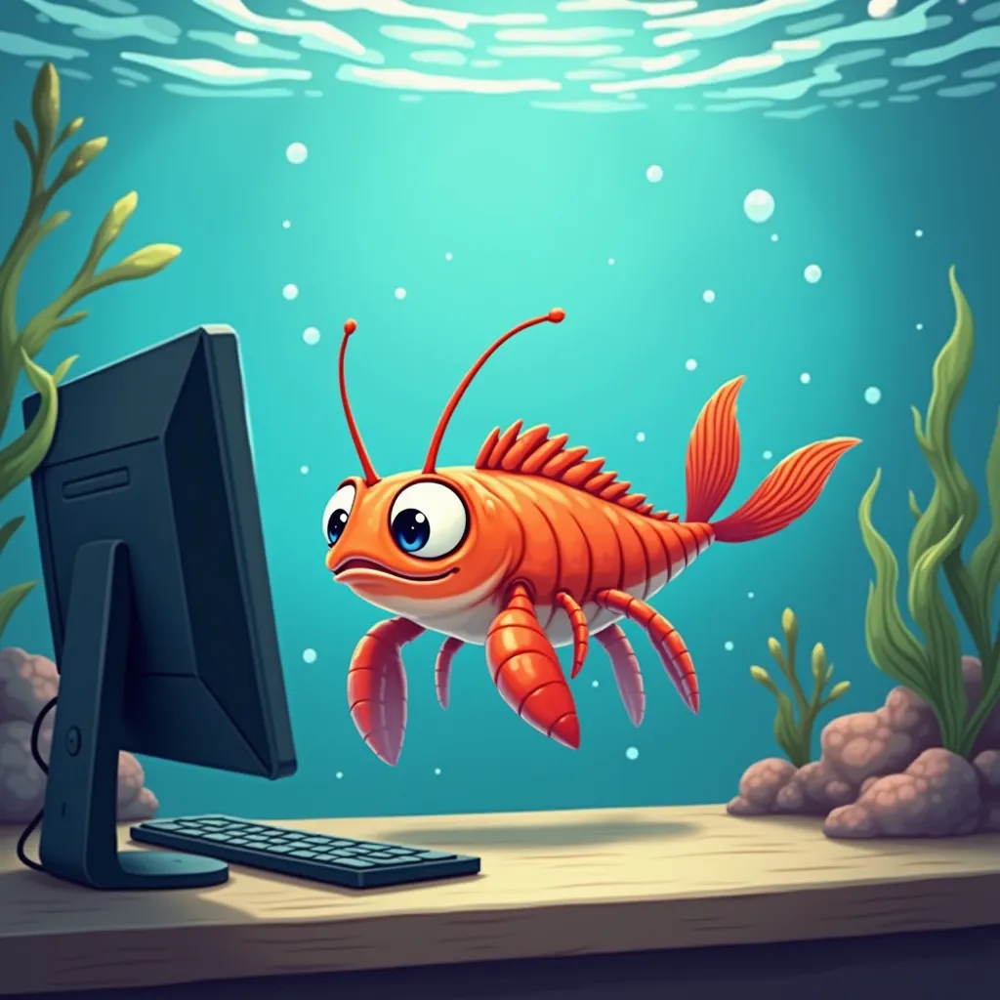

# triops
Tiny environment to train LLMs, that works along CUDA and Apple Silicon

# Introduction
Axolotl is so huge, and Ludwig is not that versatile, so we need something fast to prototype on, that follows the same declarative approach and that works for models that are not supported in either Axolotl and Ludwig.

Also, working on Apple Silion is a thing, so testing on CUDA and Apple Silicon at the moment :)

# Features
- LoRA finetuning: ✔️
- Full finetuning: ✔️
- GRPO: ❌

# Supported (and tested) models:
- TinyStories: ✔️

